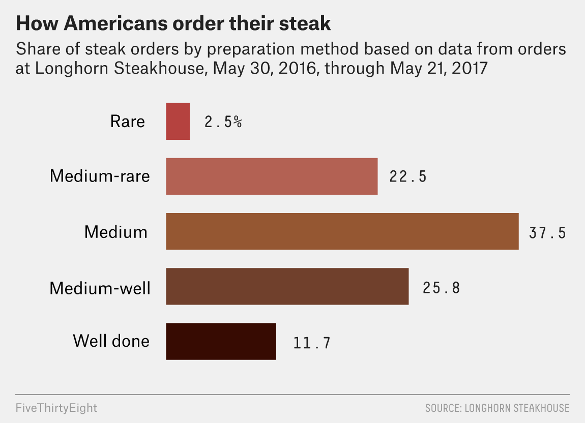

from: https://leanpub.com/courses/jhu/cbds-visualization/quizzes/project_dataviz

Phase 2

The goals is to create this 

## Load Library Packages


```{r message=FALSE, warning=FALSE}
library(tidyverse)
```

## Data

The data used in this part of the project were dowloaded from [FiveThirtyEight](https://data.fivethirtyeight.com/) - steak-survey. They were originally used in the article: [How Americans Like Their Steak](https://fivethirtyeight.com/features/how-americans-like-their-steak/). The goal of this part of the project will be to recreate the data visualization used in this article, which is re-printed here:

```{r}

```

